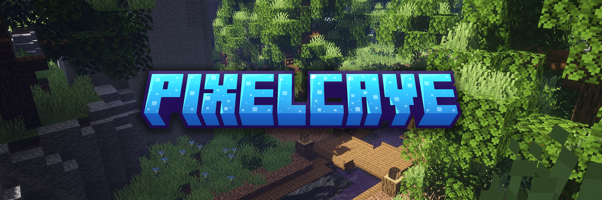

<h1 style="padding-left: 20px;">PixelCave</h1>

Willkommen auf dem offiziellen GitHub-Account des PixelCave.eu Minecraft Netzwerkes. Hier findest du unsere Open-Source-Projekte sowie Forks von Software, die wir für unser Netzwerk verwenden und weiterentwickeln.

<h2 style="padding-left: 20px;">Über uns</h2>

`PixelCaveEU` ist ein Minecraft-Community Projekt, welches aus spaß ins leben gerufen wurde, der Plan war es ein Netzwerk auf die Beine zu stellen was auf die User hört und mit der Communty zusammenarbeitet. Wir wollen Libaries die unabhängig von unserem Netzwerk sind hier Öffentlich zur verfügung stellen.

<h2 style="padding-left: 20px;">Repositories</h2>

Zurzeit haben wir keine aktiven Projekte aufgelistet, aber unsere Organisation dient als zentrale Anlaufstelle für kommende Projekte sowie Forks bestehender Open-Source-Software. Schau regelmäßig vorbei, um über unsere neuesten Entwicklungen auf dem Laufenden zu bleiben.

<h2 style="padding-left: 20px;">Mitmachen</h2>

Bitte beachte, dass wir externe Pull Requests nicht annehmen. Alle Änderungen und Verbesserungen stammen ausschließlich aus unserem internen Team. Dennoch kannst du gerne unsere Repositories durchsuchen und die Software nutzen, die wir bereitstellen.

<h2 style="padding-left: 20px;">Kontakt</h2>

Bleibe mit uns in Verbindung! Du kannst uns auf unseren sozialen Plattformen folgen:

Willkommen auf der offiziellen GitHub-Organisation des PixelCave.eu Minecraft-Netzwerks. Hier findest du unsere Open-Source-Projekte sowie Forks von Software, die wir für unser Netzwerk verwenden und weiterentwickeln.

<h2 style="padding-left: 20px;">Über uns</h2>

`PixelCaveEU` ist ein Minecraft-Community-Projekt, das aus Spaß ins Leben gerufen wurde. Der Plan war, ein Netzwerk auf die Beine zu stellen, das auf die User hört und mit der Community zusammenarbeitet. Wir möchten Libraries, die unabhängig von unserem Netzwerk sind, hier öffentlich zur Verfügung stellen.

<h2 style="padding-left: 20px;">Repositories</h2>

Zurzeit haben wir keine aktiven Projekte aufgelistet, aber unsere Organisation dient als zentrale Anlaufstelle für kommende Projekte sowie Forks bestehender Open-Source-Software. Schau regelmäßig vorbei, um über unsere neuesten Entwicklungen auf dem Laufenden zu bleiben.

<h2 style="padding-left: 20px;">Mitmachen</h2>

Bitte beachte, dass wir externe Pull Requests nicht annehmen. Alle Änderungen und Verbesserungen stammen ausschließlich aus unserem internen Team. Dennoch kannst du gerne unsere Repositories durchsuchen und die Software nutzen, die wir bereitstellen.

<h2 style="padding-left: 20px;">Kontakt</h2>

Bleibe mit uns in Verbindung! Du kannst uns auf unseren sozialen Plattformen folgen:

